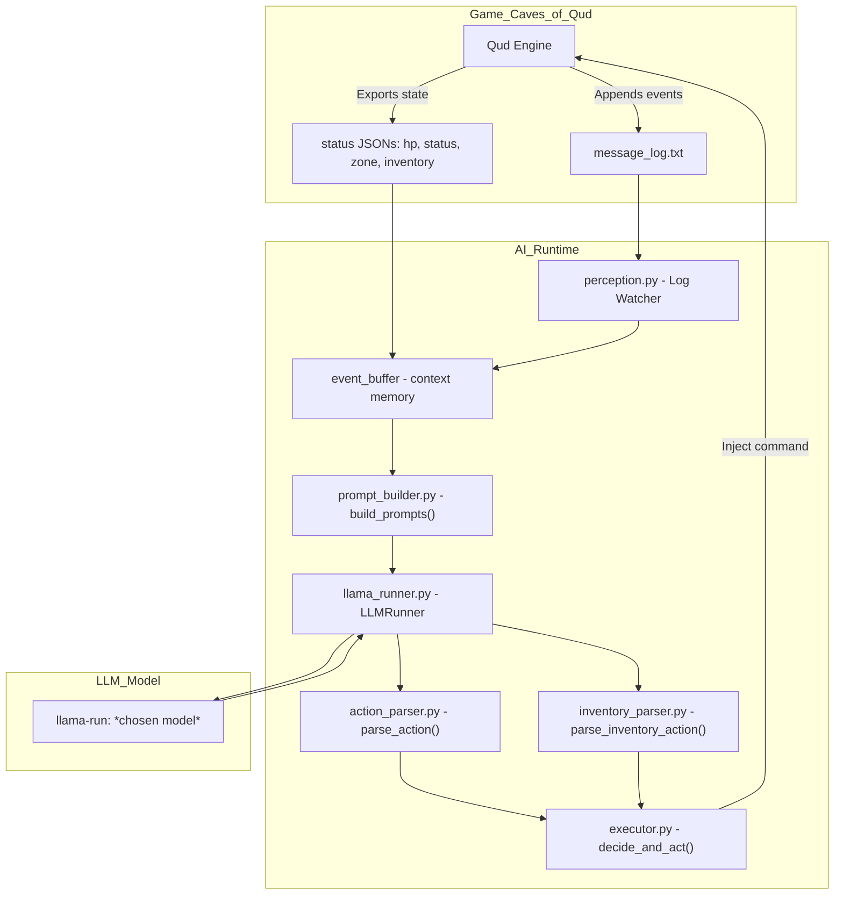

## "I'll move East to avoid that dangerous baboon"

Update is actually a few days overdue, but the gameplay loop has now been tested and works end to end!

It’s grown more than I expected this module would, but that’s probably down to the way I’m splitting functions out to make it more 'piestyx-logical' and easier for me to stay on top of everything. The actual runtime flow is shown in the mermaid chart below:

## What's the game saying?

Everything starts with the mod that exports logs to `message_log.txt`, and various game states into files like `hp_status.json` and `inventory.json`. The mod uses a `Postfix` Harmony patch to inject export behavior into the existing `MessageQueue_AddPlayerMessage` class — effectively modifying the `__result` to include an export. Simple!

That output forms the foundation for the rest of the runtime, with state exports used downstream to build context for the prompt.

## Listening

`perception.py` watches the logs and strips out all the embedded tags used in-game for color and formatting. I use this cleaned version to classify each line by 'type', making them easier to parse and format later. It also writes to `qud_decision_log.json` for downstream fine-tuning.

This is also where the prompt context is built. Since I initially used the wrong model, I added logic to format prompts for two different models, with a runtime argument flag to switch between them.

## Telling

`prompt_builder.py` takes the structured context and formats it into prompts suitable for LLM inference. As with the context, it's split for two models and tailored to their optimal prompt styles. I quickly found that inconsistent results often came from inconsistent `system_prompts` which was a side effect of logic being scattered across files. Now it’s all consolidated into `prompt_builder.py`, so I only need to tweak that file for changes.

Once the prompt is ready, it’s passed through llama.cpp into the LLM network, and out comes something like:

    `"llm_output": "I would like to drink from the deep pool of salty water to quench my thirst and replenish my energy.\u001b[0m"`

Not...ideal. Salt water doesn’t typically quench thirst, but it’s new to the game. It’ll learn.

## Doing

That response is passed into `action_parser.py` and `inventory_parser.py`. Originally there was only `parser.py`, but I hadn’t accounted for inventory interactions. It could open the inventory, sure, just not do anything in there. Hence: `inventory_parser.py`.

The main loop now checks if the last keypress opened the inventory. If so, it parses follow-up commands to equip, use, or eat items. Afterwards, it resets `inventoryOpen = False`, and gameplay continues.

Finally, `executor.py` sends keypresses to the game via [xdotool](https://github.com/jordansissel/xdotool). The game reacts, logs update, and the loop resets.

## AI gameplay is like Ogres, who are like onions...or parfait

We're talking layers, obviously.

I didn’t fully appreciate just how many layers this module would require. On the surface it’s simple: parse game logs → prompt LLM → act out the result. But the reality is far more intricate.

That inventory example is a good case. I was elated seeing the AI open the inventory after an LLM response ... only to realise it now had to do something inside that menu. As much as the response has been reasoned and presented back based on context, the response doesn't _mean_ anything to the AI.

These moments when solving one problem immediately presents a new one I hadn’t considered are awesome though. The challenge becomes how to solve it without breaking everything that’s already working, but even if it does break I know it won't be that way for too long.

It’s taken iteration, a few required scope changes, and some unrecognised scope creep but it’s now functioning. What's left now is refining the prompt engineering and making sure actions are parsed cleanly into the executor.

On to the next modules.

piestyx