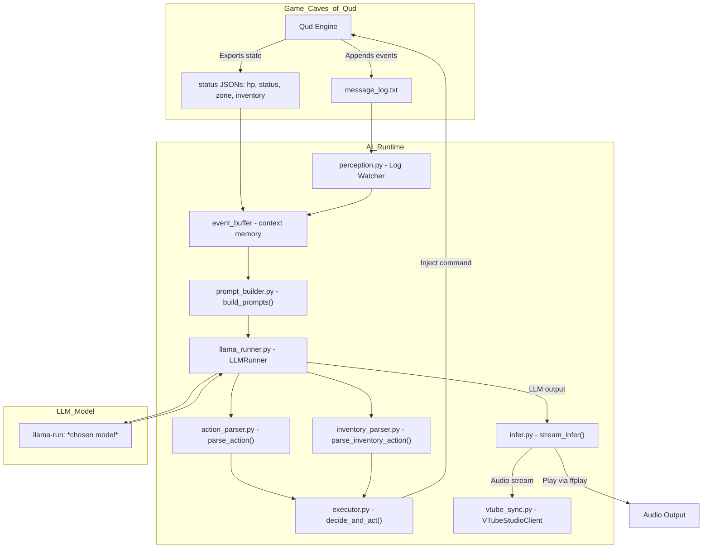

## "IT'S ALIVE! IT'S ALIVE!!"

> “Unable to endure the aspect of the being I had created, I rushed out of the room and continued a long time traversing my bed-chamber, unable to compose my mind to sleep.” - _Frankenstein by Mary Shelly_

Alright so it wasn't quite that dramatic but the sentiment still stands. Last night was the `event horizon` except I need eyes where I'm going. Damn that's a good film, you should go watch it if you haven't seen it before. The breach point was confirmed shortly after midnight when the gameplay loop ran fully **WITH** the voice output and the avatar movement. It was surreal to see it finally all click together after debugging trace backs and rewriting the LLM logic.  

## What's New?

### Voice Pipeline

Since the previous `devlog` entry I have now integrated the `voice pipeline` and the `avatar integration`. That means those responses that were coming out the LLM before are now not just being returned to the action logging and execution functions within the `qud_gameplay` module, they are also routed straight into the [index-tts](https://github.com/index-tts/index-tts) loop where they are modulated and returned as audio playback using `ffplay`. I added a function into the `indextts` class that uses the existing split sentences to pass out the audio in generated chunks instead of waiting until the full inference loop has been completed and the whole of the response audio is generated. Modulation currently uses a 7 second sample voice so there will always be that 7 second latency as it maps the waveforms against the sample to output, but, by doing it with this method it has the potential to reduce the perceived latency of the response dramatically. The benefit compounds as the length of the response grows so it's really valuable to have in place for a more rapid response that is just an emulation of speaking while thinking. 

Fixing that voice latency issue was a big win for the response times but doesn't do anything to address the length of time in the LLM generating the response. Well we can do the same process with the `LLMRunner` - another benefit of using a direct approach with something like `llama.cpp` over `Ollama` in my particular circumstance as it provides the control to be able to make these changes. The `LLMRunner` now creates an `ASync` sub-process that pipes out the `stdout` and `stderr` to a specific buffer size, the output of which can then be pulled into both the `voice pipeline` and `executor.py`. This mirrors the chunked voice output process of buffered reads streamed progressively to reduce wait time, especially beneficial at a larger response size. 

There may well be other more elegant ways of doing what I have described above, and the biggest save would probably be downgrading from the current quantized 13B parameter model for something more friendly on my GPU. I'll wait to see how it feels with extended play first. 

### Avatar Integration

I have also now been able to get the `avatar integration` set up so that the audio playback mentioned above also triggers a mouth movement on a `Live2D` model within `VTube Studio`. Normally this software package would use a webcam or a mobile phone camera to track the user's face to then map it against the model rig.  There's a snap below showing how it looks within `Live2D` - they have a wealth of information at the [Live2D Docs](https://docs.live2d.com/en/cubism-editor-manual/top/). 

You’re essentially mapping the model’s mesh vectors to your facial motion vectors so when you raise your eyebrows the model raises its eyebrows. This project, though, is using an AI so there is no face to map (no, I'm not sitting there in silence controlling the face), so how does the mouth move? `VTube Studio` allows for the creation of plugins and custom parameters, so once I authorised the plugin in `Vtube Studio` it allowed the mouth movements to be synced via a websocket API. The same principle would apply to other expressions or natural body movements such as the body moving along the y axis with breathing … which is probably the strangest way I have ever thought about breathing. If you wanted to see the rigging process in action then I would recommend this [BriAtCookieBox](https://www.youtube.com/watch?v=BfNdiTB9CcM) video, she does the rigging on her own model and is shit-hot at it to put it bluntly. 

I will hasten to add here that I have not decided that I would also take up `Live2D` and design and rig a model to use. All I have done is buy the model files and a non-exclusive right to use them from [Aka Huhu](https://x.com/Aka_huhu) of GALAXY project.

There’s still fine-tuning required to simulate phoneme movement more naturally during playback … plus a few little extras I’m considering. All of that is for another day though. With these additions, how does the flowchart look now???

## It's Tricky Tricky Tricky Trrrrrricky

It was not smooth sailing though, and I had already expected that to be the case. Effectively trying to tie together 4 different elements:

	- Gameplay loop
	- LLM function
	- Voice pipeline
	- Avatar integration

This is not a scenario where AI assisted coding shines, from my experience, as the LLM is not "remembering" the content of files that have been generated or code that has been implemented and is working. Realistically it could be engineered to be a more pleasant experience by first mapping out and understanding the exact requirements for each integration step, and then crafting a prompt and providing the context of existing code which would then provide the focus solely into what is already in place … I wasn't prepared to put that level of effort in on this occasion, which in hindsight was pretty dumb. 

To give an example of the impact this had, there is a specific file `prompt_builder.py` which handles the building of the prompt for the LLM by consolidating log entries as a context type and then building around a `system_prompt`, `instruction_prompt` and `user_prompt`. It's a masterful piece of engineering really … (it's not, it's a simple thing but keeps functions more isolated and I love isolation) … Well this `prompt_builder.py` wasn't mentioned enough clearly when I started going through the process of chopping up the LLM responses and chunking the outputs to the voice; because I got to the end to test and realised that my beautifully crafted prompt that had been generating some good responses was now throwing out a stream of syntax which, while sounding lovely, was not optimal. The changes had bypassed the `prompt_builder.py` because the instruction was to solve a problem without explicitly giving clear architecture constraints or context. 

I got it working so it was a midnight annoyance more than anything but it was still an annoyance I probably didn't need to deal with but chose to. If anything it is just a test of my increasing ability to be able to break something and then debug it and attempt a fix before resorting to mindless AI reliance. I don't believe reliance on the tool should ever be an end-goal with the vibes, it's a really good `Swiss army knife` but you don't use one of them if you're facing down a ferocious bear in the woods. This implementation phase was a good reminder that it's easy to get carried away with the vibe sometime but fundamentally everything should be backed by a clarity of purpose and a solid understanding of the architecture. 

## #qudlocked

What's next then? There's some fine tuning to do before we can truly be #qudlocked but majority implementation is complete for phase 1.

Stay tuned.

piestyx