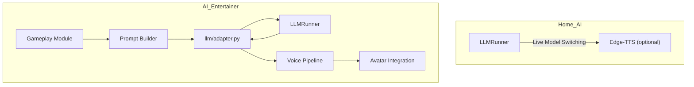

## The Refactor Traptor

It is true that refactoring can sometimes be a trap because you don't actually gain anything from doing it aside from maybe tidying up some messy code or shaving fractions of a second somewhere. My refactor recently, though, was absolutely a value add and a necessity as it was taking up far too much mental bandwidth with a niggling thought in the back of my mind that it still needed to be done. I never intended for it all to be rolled in to one, I wanted to get a baseline together and then build on top of that in a copy so that I always had that baseline template to work off for anything new and I could then also keep that as a local working version instead of using the version that is designed for entertainment. Things iterated rapidly, though, and I didn't really pay too much attention until later on and it became apparent after a while that it would be best to bite the bullet and spend the time in doing it. 

## Creating The Break

As I had initially planned on just having a home-AI companion there were hard-coded file paths sitting all over the place, semi finished pieces that I then moved away from and only a semi-separation of concerns and modularity. I had some clear goals in mind for the refactor:

	1. No hard coded pathing - everything must use a `.env` file
	2. Each element should work when used in isolation
	3. Each element should act in a modular fashion where services such as inference are called when required

Fairly simple and logical, and is now a principle I am trying to take across every project because it just makes everything easier to maintain and to grow. 

So I first went through and moved all pathing, secrets and auths into a `.env` with an accompanying `.env.example`. This act alone lifted a huge weight as there were so many different locations for it that it was getting difficult to manage and remember that one place where it might have directly pointed somewhere else. There's now 35 being tracked in there, which is a lot, but it's DRY as anything so i'm still satisfied with it. To then propagate them through the development environment I use a single utility python file that loads the `.env` and provides a constant that can then be imported to whatever needs it. 

Once that was done, I moved into making sure everything worked in isolation and that is just simple as it sounds … create a test script that uses that particular service or pipeline. It was actually the interfaces that gave me the most problems because I never fully finished doing it in the first place and it was a bit of a pain to try and get Twitch working but I now have some type of developer console and it does output and log the chat so it works as intended. Doing this bit did make the next bit much easier. 

## Everything has its' place!

Modular.

It just makes sense to me that these things should be modular and work when called upon. This is why I did really want [NixOS](https://nixos.org/) to work well for me with the AI development (I'm still looking at it to create software development environments for other projects) because it's creating that type of buffet setup where you have all these different tools and different versions and pick that one over there with a sprinkle of this … Like i said, it makes sense to me, so this is how I want the AI to also be operating.

This has been the conscious choice since bringing on the gameplay module and what has driven the requirement to refactor. The main `LLM` inference with the `LLMRunner` and `prompt router` sits away from anything else; the gameplay module has its own `llm/` directory which has an adapter file in for logic specific to that module. This is also the case for the other integrated module that is in place and will continue to be the way the architecture is applied. 

## Two?!

Now there are 2x agents that I have. The original home-AI that I was intending to create which has the `LLM` inference service with live model-switching capability and optional `edge-tts` and the AI Entertainer personality "Orielle" with the whole kit and caboodle. I am now planning to upload to my GitHub page the original home-AI version which can be reviewed and maybe even downloaded and tested your end if you have a spare 24GB of VRAM. 

The refactor lifted a lot of mental weight and let me move forward. It was tempting at times to go too deep, but that’s the trap: thinking you must rewrite something just because you’ve learned a better way. Growth is good, but don’t punish yourself for past choices that still work. Smile at the "really?" moments and keep moving, especially if you're working solo and learning as you grow. 

## Next Dev Steps

Refactor ticked off, AI personalities separated, full steam ahead on Orielle. 

Things feel a bit off with the gameplay loop so I need to spend a bit of time thinking about that and looking into what needs to change as it's not clear to me at the moment but I just got that feeling that something is missing. 

Ever onwards.

piestyx