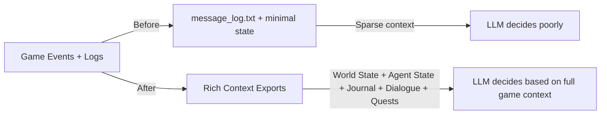
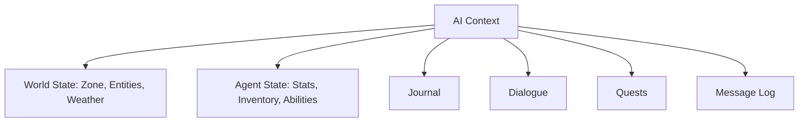

## Here Comes The Sun!!

I've been deep in the decompiler mines again recently, so *Sonne* by *Rammstein* fits naturally with the theme of coming back to the surface. Although it's been frustrating at times it is fascinating to see how elegantly the game systems are actually built. There are a lot of interwoven mechanics in the game but they piece together so well in the back end that it was starting to make sense to me by the time I had finished. Despite this though it doesn't necessarily mean there was an ideal event for me to `Postfix` trigger a log export, I may have found something if I continued to dig … but by this time the canary had already expired and I was pushing my luck staying down there for as long as I had. 

## Didn't You Do This Already?

Ah how very astute of you, clearly an avid reader of the blog.

Yes! I had indeed scratched at the surface and thought that old approach would be sufficient but as I began testing I was soon disabused of that notion as it exposed my approach to autonomous play was fundamentally flawed. There was no proper reward or reinforcement mechanism, and the AI kept falling back on default actions until it stopped entirely. And it's no surprise given what the AI was actually working with:

```json
{
  "move_north": {
    "command": "KP_8",
    "state": "discovered",
    "attempts": 1,
    "successes": 1,
    "failures": 0
  },
  ...
}
```

And a corresponding log:

```txt
[13:27:59] You hit the wet glowfish for 16 damage!
[13:27:59] The wet glowfish dies!
[13:28:02] You pass by a watervine.
[13:28:08] The giant dragonfly begins flying.
...
```

And then told to decide what to do next. 

There was no awareness of the bigger picture: no understanding of surrounding threats, no goal orientation, no sense of progress beyond these isolated actions. The AI was effectively blind, and at risk of being savaged by 4 furious baboons because of it.

I needed to give the AI something closer to what a human player actually sees, the full game UI’s worth of information at each step. Which means …


## The Richer Context Fix

Humans can see and process the full game UI. For the AI to reason effectively, the exports need to match that level of detail, providing a fuller context for reasoning, risk assessment, and goal-oriented play.

**The before and after paths**



**The context threads weaving the tapestry**



I may yet find that even more context is needed. Hopefully not … I’d rather not don the miner’s hat again just yet.

## The Kicker

Ask yourself though, if you went from one map zone to another, would you remember everything that was on the previous zone? Have you ever been looking for something and walked into another room to find it and instantly forgotten what you were looking for? 

This is an example of evolutionary fallibility, optimisation for constraints that no longer apply. When you're looking for your keys and walk through from one room to the next, the act of entering that new area gives the brain a type of soft reset in cache memory. Your brain dumps the old and grabs all the new while looking for danger and threat, but because you were _looking_ for your keys which is activating the visual parts of the brain, it got dumped. That process is one that needs to happen in the same way that C# does garbage collection, it's just a process that also runs on `meatware`.

This matters because in my endless striving to create a more human like experience, I have given my AI the same evolutionary fallibility that we have. Imperfection is relatable. The AI shouldn't always just be finding the most efficient path, it should reason and sometimes stumble, exhibiting intent over just computation of an answer. Relatability doesn't come from perfection but from trying and failing in human ways. And on whether an AI can be said to show intent, reason is just intent wearing different shoes.  

## Next up

I need to finish the sandbox loop, wire in the reward and reinforcement mechanisms, and test how well the AI performs with its new perspective. I will also be looking to finally integrate a memory retention module with PostgreSQL as long-term memory and Redis as a short-term cache to keep latency low. 

The blindfold's off. Let's see how she plays.

piestyx

